<div align="center">



<br/><br/>


<br/>


</div>

---

## ✨ ¿Qué es English Era?

**English Era** es una plataforma educativa multiplatforma para aprender inglés de forma real, estructurada y motivadora — sin contenido prefabricado ni ejercicios aburridos.

Todo en un único entorno:

| 🧠 Practica | 📰 Aprende | 👥 Conecta | 🤖 Pregunta |
|------------|-----------|-----------|------------|
| Cuestionarios por nivel MCER con sistema de XP | Noticias reales, canciones, PDFs y vídeos organizados por dificultad | Blog, comentarios y eventos presenciales y virtuales | Asistente IA basado en Llama 3.3 que responde en inglés y español |

---

## 🏗️ Arquitectura

```
English Era
├── backend-tfg/          → Spring Boot (API REST)
│   └── database/
│       └── docker-compose.yml
├── frontend-tfg/         → React + TypeScript (Vite + Tailwind CSS)
└── movil-tfg/            → React Native + Expo (Android / iOS)
```

> Ambos clientes (web y móvil) consumen la misma API REST. La autenticación se gestiona con tokens JWT.

---

## 🛠️ Stack tecnológico

<div align="center">

| Capa | Tecnología |
|------|-----------|
| 🖥️ Backend | Spring Boot · Spring Security · Spring Data JPA |
| 🗄️ Base de datos | MySQL 8.0 · MongoDB 7 |
| 🌐 Frontend web | React · TypeScript · Vite · Tailwind CSS · React Router |
| 📱 App móvil | React Native · Expo · expo-secure-store · expo-file-system |
| 🐳 Infra | Docker · Docker Compose |
| 🤖 IA | Llama 3.3 70B vía Groq API |
| 📰 Noticias | NewsAPI.org |

</div>

---

## 🚀 Instalación rápida

### Requisitos previos

| Herramienta | Versión | Para qué |
|-------------|---------|----------|
| [Docker Desktop](https://www.docker.com/products/docker-desktop/) | Última | Backend + Frontend web + BBDDs |
| [Node.js](https://nodejs.org) | 20+ | Solo para la app móvil |

### ⚡ Levantar todo con un comando

```bash
git clone https://github.com/MigleDubauskaite/Migle_TFG_EnglishEra.git
cd Migle_TFG_EnglishEra/backend-tfg/database
docker compose up -d --build
```

Esto levanta automáticamente: **MySQL · MongoDB · Spring Boot · React · Adminer**

> 💡 El frontend corre en el puerto `3000` con Docker. Si usas `npm run dev` directamente, Vite arranca en el puerto `5173`.

---

## 🔑 API Keys (servicios externos)

El proyecto usa dos servicios **gratuitos** que requieren registro:

| Servicio | Para qué | Registro |
|----------|----------|----------|
| 🤖 Groq | Asistente IA (Llama 3.3) | [console.groq.com/keys](https://console.groq.com/keys) |
| 📰 NewsAPI | Noticias en tiempo real | [newsapi.org](https://newsapi.org) |

Una vez obtenidas, añádelas en `backend-tfg/database/docker-compose.yml`:

```yaml
environment:
  GROQ_API_KEY: "tu_groq_key_aqui"
  NEWSAPI_KEY: "tu_newsapi_key_aqui"
```

> ⚠️ Sin estas keys la plataforma funciona con normalidad — solo el asistente IA y las noticias quedarán sin datos.

---

## 🌐 URLs de acceso

<div align="center">

| Servicio | URL |
|----------|-----|
| 🌍 Frontend web | http://localhost:3000 |
| 📖 Swagger / API docs | http://localhost:8080/swagger-ui/index.html |
| 🗄️ Adminer (gestión BD) | http://localhost:8082 |

</div>

### Credenciales Adminer

```
Sistema:        MySQL
Servidor:       mysql-db
Usuario:        root
Contraseña:     root123
Base de datos:  tfg_english_db
```

---

## 🔐 Credenciales de prueba

Creadas automáticamente por el `DataLoader` al arrancar — listas para usar:

<div align="center">

| Rol | Email | Contraseña |
|-----|-------|------------|
| 👑 Administrador | admin@gmail.com | admin123 |
| 🎓 Usuario estándar | student@tfg.com | pass123 |

</div>

---

## 📱 Aplicación móvil

Desarrollada con React Native + Expo · Probada en **Android** (emulador y dispositivo físico)

### 📥 Descargar APK

> **[⬇️ Descargar APK](https://expo.dev/artifacts/eas/0eg2Q3cMsmioVG7sx9LkXTbTizPFtEPJpDc32Lbu1oY.apk)**

### 🔨 Generar APK tú mismo

```bash
cd movil-tfg
eas build --platform android --profile preview
```

### 💻 Ejecutar en desarrollo

```bash
cd movil-tfg
npm install
npx expo start
```

### 🔗 Conectar la app con el backend

Si el backend corre en Docker (`localhost:8080`), un dispositivo físico no llega a ese `localhost`. Solución con **ngrok**:

**1.** Crea cuenta gratuita en [ngrok.io](https://ngrok.io) y configura tu token:
```bash
ngrok config add-authtoken <tu-token>
```

**2.** Expón el backend:
```bash
ngrok http 8080
```

**3.** Pega la URL generada en `movil-tfg/src/api/client.ts` (línea 6):
```ts
: 'https://xxxx.ngrok-free.app'; // ← pega aquí tu URL ngrok
```

**4.** Arranca la app:
```bash
npx expo start --tunnel
```

---

## 👤 Roles de usuario

| Rol | Acceso |
|-----|--------|
| 🎓 Usuario estándar | Cuestionarios · Recursos · Comunidad · Perfil · Asistente IA |
| 👑 Administrador | Todo lo anterior + panel de administración (usuarios · preguntas · publicaciones · comentarios) |

---

## 📊 Sistema de progresión MCER

<div align="center">

| Nivel | XP necesario | Categoría |
|-------|-------------|-----------|
| A1 → A2 | 500 XP | 🟢 Usuario básico |
| A2 → B1 | 1.500 XP | 🟢 Usuario básico |
| B1 → B2 | 3.000 XP | 🟡 Usuario independiente |
| B2 → C1 | 5.000 XP | 🟡 Usuario independiente |
| C1 → C2 | 8.000 XP | 🔵 Usuario competente |

</div>

> Cada respuesta correcta otorga **10 XP** ⚡

---

## 📁 Estructura del proyecto

```
backend-tfg/
├── src/main/java/         → Controladores, servicios, repositorios, entidades
├── src/main/resources/    → application.properties
├── Dockerfile
└── database/
    └── docker-compose.yml

frontend-tfg/
├── src/
│   ├── pages/             → Home, Quiz, Resources, Blog, Events, Profile, Admin, Login, Register
│   ├── components/        → Navbar, Footer, ChatWidget, componentes reutilizables
│   └── api/               → Módulo cliente centralizado (inyección JWT, manejo 401/403)
├── Dockerfile
└── package.json

movil-tfg/
├── app/                   → Pantallas y navegación (Stack + Tab navigator)
├── components/            → Componentes reutilizables
└── package.json
```

---

<div align="center">

Proyecto académico · TFG DAM · Core Networks Sevilla · 2026

**Miglė Dubauskaitė**

</div>
